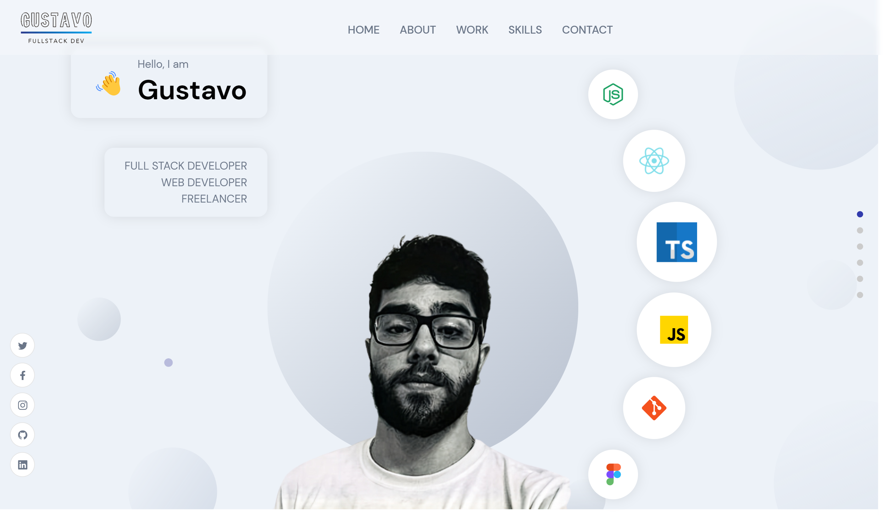

<h1 align="center"> Portfolio </h1>

  <a href="#-tecnologias">Tecnologias</a>&nbsp;&nbsp;&nbsp;|&nbsp;&nbsp;&nbsp;
  <a href="#-projeto">Projeto</a>&nbsp;&nbsp;&nbsp;&nbsp;&nbsp;&nbsp;</a>

 

  

## 🚀 Tecnologias

Esse projeto foi desenvolvido com as seguintes tecnologias:

- [ReactJS](https://reactjs.org)
- [Sanity](https://www.sanity.io/)
- [Framer Motion](https://www.framer.com/motion/)

## 💻 Projeto

O projeto é um portfólio pessoal, onde é possível ver meus projetos e entrar em contato comigo. O projeto foi desenvolvido com o intuito de praticar o uso do Sanity, uma plataforma de CMS e também para praticar o uso do ReactJS além de que eu precisava ter um portfólio pessoal. Não posso esquecer também das animações com o Framer Motion, que foi uma experiência muito boa e recomendo a todos que queiram praticar animações com ReactJS.

---

Feito com ♥ by Gustavo Batista :wave: [LinkedIn](https://www.linkedin.com/in/gustavo-h-batista/) e [GitHub](https://github.com/gustavohdab)
